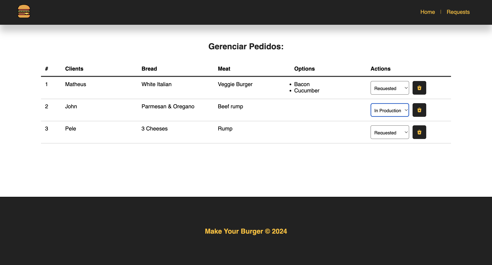
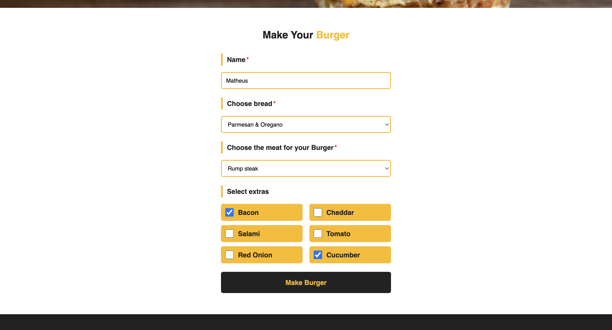

<h1 align="center">Make Your Burger</h1>

<p align="center">Burger ordering platform with intuitive customer app and integrated dashboard for real-time order tracking at restaurants.</p>

<br />

## Screenshots

#### Home



#### Request



#### Dashboard


<br />

## Running the Application

<i>Follow the steps to run the Project on your local machine.</i>

#### Requirements

- [Node](https://nodejs.org/en/)
- [Yarn](https://classic.yarnpkg.com/lang/en/) or [Npm](https://www.npmjs.com/)

#### Clone the repository and navigate to the folder

```
$ git clone https://github.com/MatheusPalmieri/make-your-burger && cd make-your-burger
```

#### Installing necessary dependencies

```
$ npm install or yarn
```

#### Run Frontend

```
$ npm run server
```

#### Run Backend

```
$ npm run backend
```

<i>Open the browser on the page "http://localhost:8080" to view.</i>

<br />

## Technologies

<p>The following tools were used in the project:</p>

**Frontend**: Vue, JavaScript, and CSS.
<br />
**Backend**: JSON Server.

<br />

## License

This project is licensed under the [MIT License](LICENSE).

<br />

## Author

Created by <b>`Matheus Palmieri`</b>👨‍💻

<br />

<p align=\"center\">📜 Make Your Burger V1.1.0 🚀</p>
